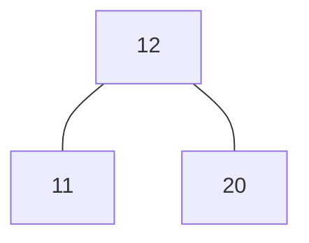
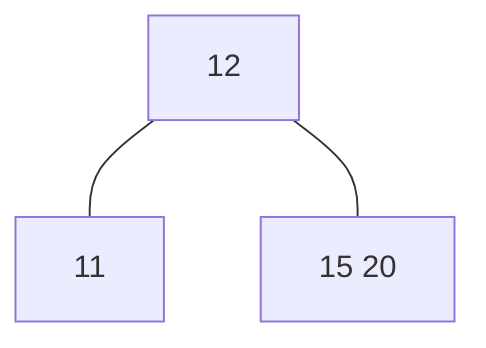
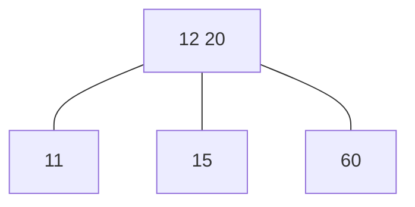
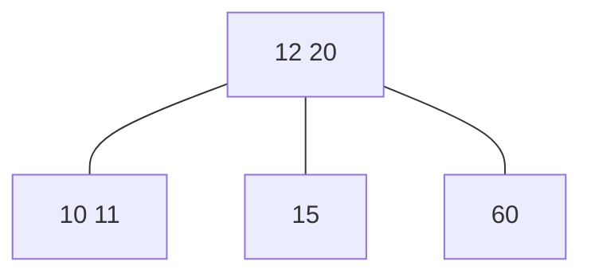
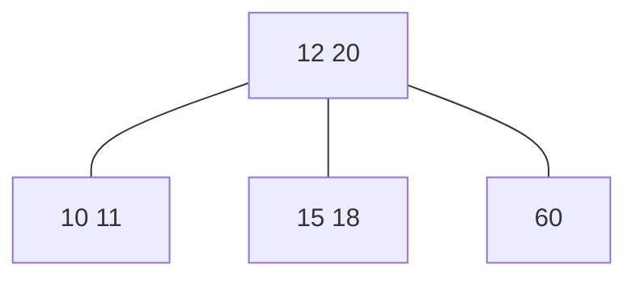
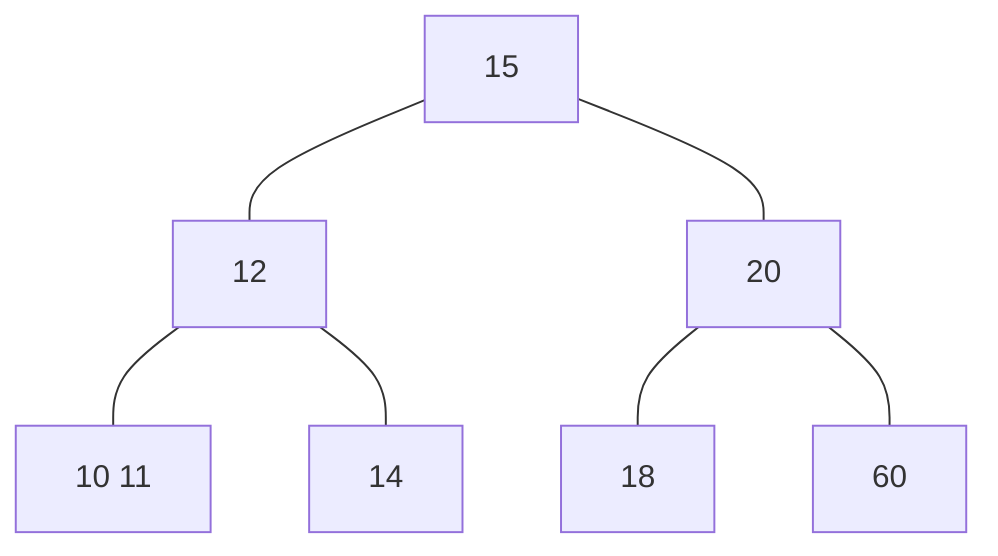
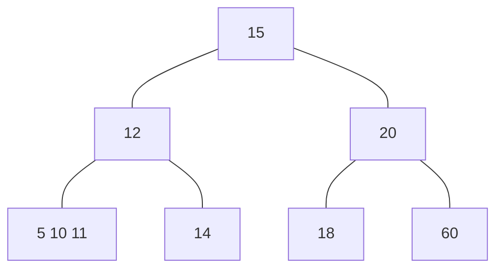
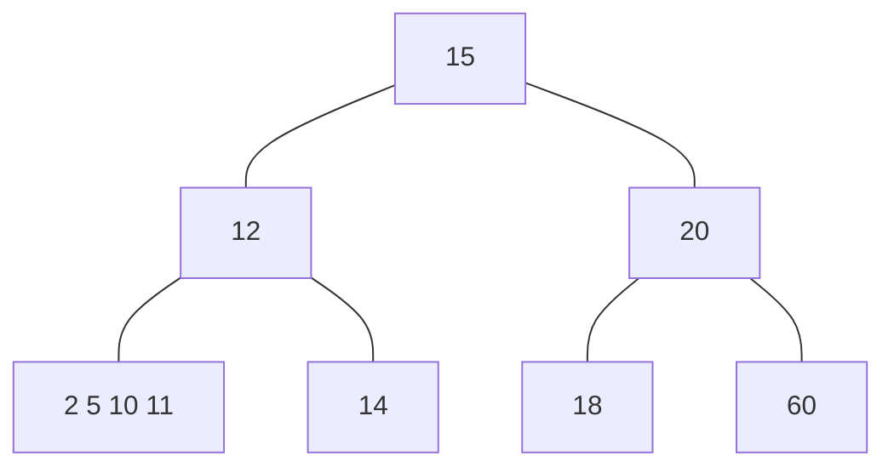
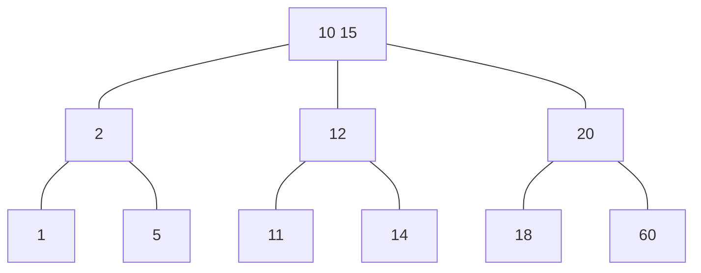

11, 12, 20, 15, 60, 10, 18, 14, 5, 2, 1

Einfügen 11 
11 
Einfügen 12 
11 | 12 
Einfügen 20 
11 12 20 => 12
        11|20
Einfügen 15 
      (12)->((11),(15|20))
Einfügen 60
      (12)->((11),(15|60|20))
      (12|20)->((11),(15),(60))
Einfügen 10 
      (12|20)->((10|11),(15),(60))
Einfügen 18
      (12|20)->((10|11),(15|18),(60))
Einfügen 14
      (12|20)->((10|11),(14|15|18),(60))
       (12|15|20)->((10|11),(14|18),(60))
       (15) -> ((12) -> ((10|11),(14))    , (20) -> ((18),(60)) )
Einfügen 5
       (15) -> ((12) -> ((5|10|11),(14))    , (20) -> ((18),(60)) )
       (15) -> ((10|12) -> ((5),(11),(14))    , (20) -> ((18),(60)) )
Einfügen 2
       (15) -> ((10|12) -> ((2|5),(11),(14))    , (20) -> ((18),(60)) )
Einfügen 1
       (15) -> ((10|12) -> ((1|2|5),(11),(14))    , (20) -> ((18),(60)) )
       (15) -> ((2|10|12) -> ((1),(5),(11),(14))    , (20) -> ((18),(60)) )
       (10|15) -> ((2),(12)) -> ((1),(5),(11),(14))    , (20) -> ((18),(60)) )
           (10|15) -> ((2) -> ((1),(5))    , (12) -> ((11,(14))), (20) -> ((18),(60)) )


> **Nutzen**
>
> * Die Datei lässt sich direkt auf GitHub, GitLab, StackEdit, VS Code Preview usw. anzeigen.
> * Kein externes Bild nötig – Mermaid rendert den Baum automatisch.

```markdown
# B‑Baum Ordnung 1 · Einfügefolge 11 → … → 1

Jeder *details*‑Block enthält ein Mermaid‑Diagramm.  
Knoten sind Rechtecke mit dem/den Schlüssel(n); Pfeile zeigen Kind­zeiger.

---

## Legende

```

\[11]           … Baum mit einem Schlüssel
\[11 12]        … Knoten (Ordnung 1 erlaubt max. 2 Schlüssel)

````

---

<details>
<summary>Schritt 1 · insert(<strong>11</strong>)</summary>

```mermaid
graph TD
    N11["11"]
````

</details>

<details>
<summary>Schritt 2 · insert(<strong>12</strong>)</summary>

```mermaid
graph TD
    N["11 12"]
```

</details>

<details>
<summary>Schritt 3 · insert(<strong>20</strong>) → Split Wurzel</summary>



</details>

<details>
<summary>Schritt 4 · insert(<strong>15</strong>)</summary>



</details>

<details>
<summary>Schritt 5 · insert(<strong>60</strong>) → Split Blatt</summary>



</details>

<details>
<summary>Schritt 6 · insert(<strong>10</strong>)</summary>



</details>

<details>
<summary>Schritt 7 · insert(<strong>18</strong>)</summary>



</details>

<details>
<summary>Schritt 8 · insert(<strong>14</strong>) → Split Mitte, Root übervoll → neue Wurzel 15</summary>



</details>

<details>
<summary>Schritt 9 · insert(<strong>5</strong>)</summary>



</details>

<details>
<summary>Schritt 10 · insert(<strong>2</strong>)</summary>



*Hinweis:* Das Blatt `2 5 10 11` enthält nun 4 Schlüssel; beim nächsten Schritt wird es gesplittet.

</details>

<details>
<summary>Schritt 11 · insert(<strong>1</strong>) → letzter Split &amp; Promotion</summary>



</details>

---

## Endbaum (alle 11 Schlüssel)


> *Alle Knoten erfüllen Ordnung 1: max 2 Schlüssel pro Knoten, Wurzel ≤ 2;
> Such­baumeigenschaft erhalten, Blätter liegen auf gleicher Tiefe.*

```

> **Speichern** als `baum_ord1.md` und auf GitHub oder einem anderen Markdown‑Renderer mit Mermaid‑Support öffnen.  
> Du kannst einzelne Details ein- oder ausklappen; die Diagramme passen sich automatisch an.
```


