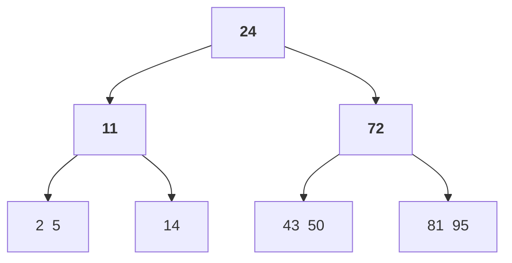
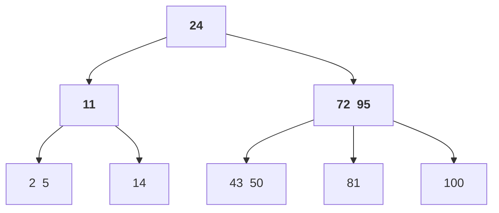
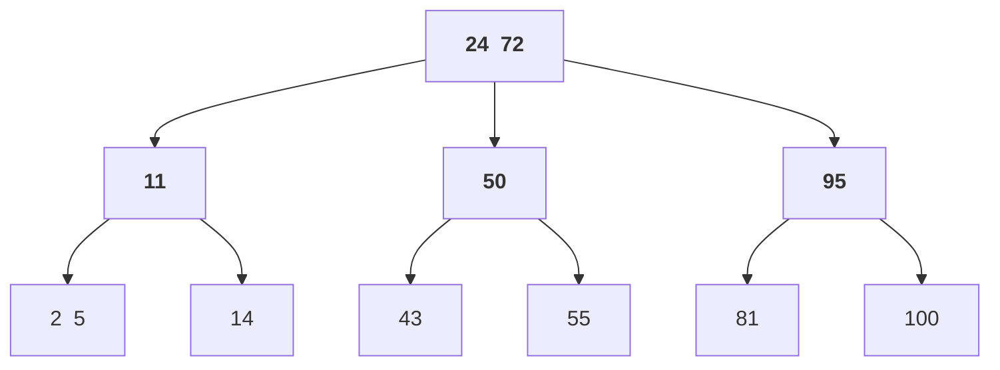
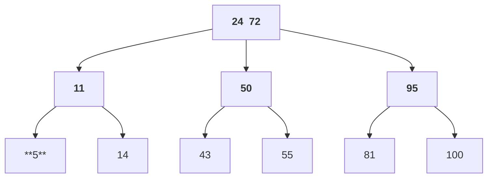
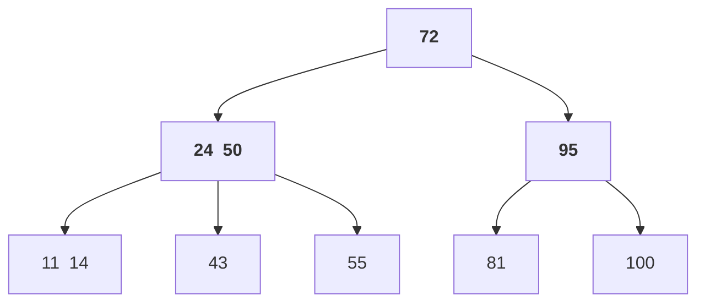
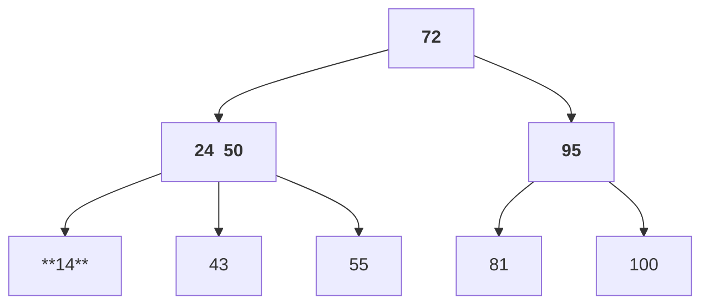
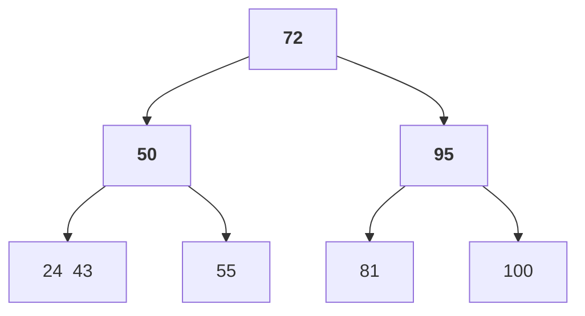
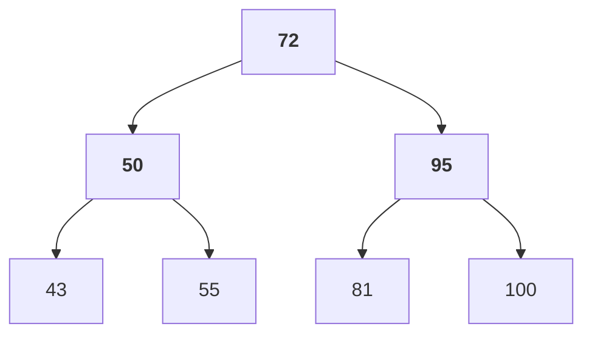

Alles klar – ich erarbeite jetzt eine korrekte und vollständige Lösung zu Aufgabe 3 aus dem Übungsblatt 25\_13. Ich achte dabei besonders auf alle Regeln für das Löschen in B-Bäumen der Ordnung 1 und dokumentiere die Zwischenschritte präzise.

Ich melde mich, sobald die Lösung inklusive aller relevanten Erklärungen und Baumzustände bereit ist.

# Lösung zu Aufgabe 3 (B-Baum Löschoperationen)

## Gegebener Anfangsbaum

Wir betrachten einen B-Baum der **Ordnung 1** (d.h. jeder Knoten enthält max. 2 Schlüssel und min. 1 Schlüssel, außer die Wurzel darf auch leer sein). Der Anfangszustand des Baumes hat **drei Ebenen** (Wurzel = Ebene 1, interne Knoten = Ebene 2, Blätter = Ebene 3) und ist wie folgt aufgebaut:

*Initialer B-Baum:* Die Wurzel enthält den Schlüssel **24** und hat zwei Kinder. Links der Wurzel liegt ein Innenknoten mit Schlüssel **11**, rechts ein Innenknoten mit **72**. In Ebene 3 sind vier Blattknoten: links die Blätter `[2 5]` und `[14]` (im linken Teilbaum ≤24), rechts die Blätter `[43 50]` und `[81 95]` (im rechten Teilbaum >24). Man sieht, dass alle Knoten (bis auf die Wurzel) die Minimalbelegung von 1 Schlüssel erfüllen.

Ziel ist es, durch eine Folge von Einfüge- und Löschoperationen den Baum so umzustrukturieren, dass **zu jeder Zeit** drei Ebenen vorhanden sind und am **Ende** der Schlüssel **43** im **ganz linken Blattknoten** (Ebene 3) liegt. Im Folgenden werden die Operationen Schritt für Schritt durchgeführt, mit Diagrammen und Erklärungen zu etwaigen **Borrow-** (Schlüsselentnahme vom Nachbarn) und **Merge-Operationen** (Verschmelzen von Knoten), die beim Löschen notwendig werden.

## Schritt 1: *Einfügen* des Schlüssels **100**

Zunächst fügen wir einen neuen größten Schlüssel **100** in den B-Baum ein. Dies dient dazu, genügend Puffer zu schaffen, damit spätere Löschungen nicht zur Höhenreduktion führen.

* **Einfügeort:** 100 ist größer als alle vorhandenen Schlüssel, also wandert die Suche nach dem Einfügeplatz in den *rechten* Teilbaum (Schlüssel >24) bis ins *rechte* Blatt `[81 95]`.

* **Blattüberlauf:** Das Blatt `[81 95]` enthält bereits 2 Schlüssel (Maximalbelegung). Das Einfügen von 100 führt zu 3 Schlüsseln `[81, 95, 100]` in diesem Blatt, was einen **Überlauf** erzeugt. Daher wird dieses Blatt **gesplittet**:

  * Median (mittlerer Schlüssel) = **95**. Dieser steigt in den Elternknoten auf.
  * Linkes neues Blatt enthält die Schlüssel kleiner als 95: `[81]`.
  * Rechtes neues Blatt enthält die Schlüssel größer als 95: `[100]`.

* **Eltern aktualisieren:** Der Elternknoten (Innenknoten mit bisher **72**) übernimmt den Median **95** als neuen Schlüssel. Der Innenknoten hatte vorher 1 Schlüssel und erhält nun einen zweiten Schlüssel:

  * Vorher: Elternknoten `[72]` mit Kindern (links→`[43 50]`, rechts→`[81 95]`)
  * Nachher: Elternknoten `[72 95]` mit nun *drei* Kindern:

    * Kind0: `[43 50]` (Schlüssel ≤72)
    * Kind1: `[81]` (Schlüssel >72 und <95)
    * Kind2: `[100]` (Schlüssel >95)

Die Wurzel hat nach wie vor einen Schlüssel 24 (nicht voll, also kein Überlauf in der Wurzel). Der Baum bleibt drei Ebenen hoch. Der neue Baumzustand nach Einfügen von 100:

*Erläuterung:* Der rechte Innenknoten enthält jetzt die Schlüssel 72 und 95. Seine Kinder sind entsprechend dreigeteilt (`≤72`, `>72 bis ≤95`, `>95`). Beachte, dass die Wurzel immer noch nur einen Schlüssel (24) hat und somit zwei Kinder (`LINT11` und `RINT72`).

## Schritt 2: *Einfügen* des Schlüssels **55**

Als Nächstes fügen wir den Schlüssel **55** ein. Dieses Einfügen wird einen Split bis zur Wurzel verursachen und die Wurzel mit einem zweiten Schlüssel ausstatten. Damit stellen wir sicher, dass die Wurzel anschließend 2 Schlüssel hat – so kann sie im Verlauf der Löschungen einen Schlüssel verlieren, ohne sofort die Höhe zu reduzieren.

* **Einfügeort:** 55 ist größer als 24, also geht es in den rechten Teilbaum. Im Innenknoten `[72 95]` entscheidet 55 < 72, daher folgt der Einfügepfad dem **linken Kind** (Bereich >24 und ≤72), nämlich dem Blatt `[43 50]`.

* **Blattüberlauf:** Im Blatt `[43 50]` liegen 2 Schlüssel (voll). Durch Einfügen von 55 entstehen `[43, 50, 55]` – ein Überlauf. Wir splitten das Blatt:

  * Median = **50** steigt in den Elternknoten auf.
  * Neues linkes Blatt: `[43]`
  * Neues rechtes Blatt: `[55]`

* **Überlauf im Innenknoten:** Der Elternknoten war der Innenknoten `[72 95]`, welcher bereits 2 Schlüssel hatte. Durch das Aufsteigen von **50** würde er nun 3 Schlüssel `[50, 72, 95]` enthalten – Überlauf in diesem Innenknoten.

  * Median = **72** (mittlerer Schlüssel der sortierten Sequenz 50,72,95) steigt eine Ebene höher **in die Wurzel** auf.
  * Der Innenknoten `[72 95]` spaltet sich in zwei Innenknoten:

    * Linker neuer Innenknoten erhält Schlüssel <72: das ist **50**. (Knoten `[50]`)
    * Rechter neuer Innenknoten erhält Schlüssel >72: das ist **95**. (Knoten `[95]`)
  * Die Kinder werden entsprechend aufgeteilt:

    * Linker Innenknoten `[50]` Kinder: `[43]` und `[55]` (aus dem Split des Blattes; alle Schlüssel ≤50 bzw. >50≤72).
    * Rechter Innenknoten `[95]` Kinder: `[81]` und `[100]` (alle Schlüssel >72; 81 ≤95 und 100 >95).

* **Wurzel aktualisieren:** Die Wurzel hatte vorher einen Schlüssel 24. Nun steigt **72** aus dem überlaufenden Innenknoten auf. Die Wurzel nimmt 72 als zweiten Schlüssel auf:

  * Vorher: Wurzel `[24]` mit zwei Kindern (links `LINT11`, rechts alter `RINT72`).
  * Nachher: Wurzel `[24 72]` mit *drei* Kindern:

    * Kind0: der linke Teilbaum `LINT11` (unverändert, Schlüssel ≤24)
    * Kind1: neuer Innenknoten `[50]` (aus Split entstanden, Schlüssel >24 ≤72)
    * Kind2: neuer Innenknoten `[95]` (Schlüssel >72)

Der Baum bleibt dreistufig. Die Wurzel ist jetzt **voll** (2 Schlüssel). Das ist günstig für die kommenden Löschschritte, da die Wurzel nun einen Schlüssel „auf Reserve“ hat. Der Zustand nach Einfügen von 55:

*Erläuterung:* Die Wurzel enthält jetzt die Trennschlüssel 24 und 72. Links davon liegt der Teilbaum ≤24 (unverändert mit Innenknoten `[11]`), in der Mitte der neue Teilbaum >24 ≤72 (Innenknoten `[50]` mit Blättern `[43]` und `[55]`), und rechts der Teilbaum >72 (Innenknoten `[95]` mit Blättern `[81]` und `[100]`). Damit ist der Baum für die Löschungen vorbereitet – insbesondere hat die Wurzel zwei Schlüssel, sodass ein eventuelles Entfernen eines Wurzelschlüssels nicht sofort zum Verlust einer Ebene führt.

## Schritt 3: *Löschen* des Schlüssels **2**

Nun beginnen die Löschoperationen, um alle Schlüssel < 43 zu entfernen. Zuerst löschen wir **2**, das sich im linken Blatt `[2 5]` befindet.

* **Löschen 2:** Wir finden 2 im linken Blatt `[2 5]` (unter Innenknoten 11). Nach dem Entfernen bleibt das Blatt mit **\[5]** (einem Schlüssel) übrig.
* **Unterlauf prüfen:** Das Blatt hat jetzt 1 Schlüssel, was genau der **Minimalbelegung** entspricht (Ordnung 1 → min. 1 Schlüssel pro Blatt). **Kein Unterlauf** liegt vor, d.h. keine weiteren Maßnahmen nötig.

Der Baum nach Löschen von 2 (Änderungen **fett** markiert):

*Kommentar:* Durch das Löschen von 2 wurde das Blattknoten `[2 5]` auf einen Schlüssel reduziert (`[5]`). Dies ist zulässig, da das Blatt nun genau die minimale Anzahl von 1 Schlüssel enthält. Die Baumstruktur und alle Trennschlüssel (11, 24, 50, 72, 95) bleiben unverändert. Es waren keine Borrow/Merge-Operationen erforderlich.

## Schritt 4: *Löschen* des Schlüssels **5**

Als Nächstes löschen wir **5**, den letzten Schlüssel im gleichen Blatt (jetzt `[5]`). Dies führt zu einem **Unterlauf**, der durch geeignete Operationen behoben werden muss.

* **Löschen 5:** Schlüssel 5 liegt im Blatt `[5]` (linkester Blattknoten unter Innenknoten 11). Nach dem Entfernen ist dieses Blatt **leer** (`[]` enthält 0 Schlüssel).

* **Unterlauf im Blatt:** Ein leerer Blattknoten verletzt die Mindestbelegung. Wir versuchen, ihn durch **Borrow-Operation** aus einem Geschwisterknoten aufzufüllen:

  * Geschwisterknoten: Der Knoten `[5]` hatte einen rechten Geschwister `[14]` (unter demselben Eltern `[11]`). Dieser enthält 1 Schlüssel (Minimalbelegung) und kann **nichts entleihen**. Ein linker Geschwister existiert nicht (das zu löschende Blatt war das linke Extrem).
  * **Borrow nicht möglich**, daher **Merge notwendig**: Wir verschmelzen das leere Blatt mit seinem rechten Geschwister `[14]` **und** ziehen den Elternschlüssel **11** mit in die Verschmelzung.
  * Durch Merge entsteht ein neuer Blattknoten `[11 14]`: Er enthält die Schlüssel {11 (vom Elternknoten) + 14}. Der leere Blattknoten wird entfernt.
  * Der Elternknoten (Innenknoten **11**) verliert durch diese Aktion seinen einzigen Schlüssel (11 wurde nach unten gezogen) und einen Kindzeiger. Damit hat dieser Innenknoten jetzt **0 Schlüssel**.

* **Unterlauf im Innenknoten:** Der Innenknoten (ehemals `[11]`) mit 0 Schlüsseln erfüllt nicht die Mindestbelegung (mind. 1 für einen Nicht-Wurzel-**Innenknoten**). Wir müssen ihn ebenfalls ausgleichen:

  * Eltern des unterlaufenden Innenknotens ist die **Wurzel** `[24 72]`. Der unterlaufende Innenknoten ist das **linke Kind** der Wurzel, sein nächster rechter Geschwister ist der Innenknoten `[50]` (mittleres Kind der Wurzel). `[50]` enthält 1 Schlüssel (minimale Belegung für Innenknoten).

  * **Borrow von Geschwister**: Der rechte Geschwister `[50]` kann keinen Schlüssel abgeben (hat nur 1). Ein linker Geschwister existiert nicht, da der unterlaufende Knoten das linke Kind der Wurzel war.

  * **Merge mit Geschwister und Elternschlüssel:** Wir verschmelzen den unterlaufenden Innenknoten (leer) mit seinem rechten Geschwister `[50]` **und** dem Elternschlüssel **24** aus der Wurzel:

    * Aus Schlüssel {24 (Wurzel) + 50 (Geschwister-Inhalt)} entsteht ein neuer Innenknoten `[24 50]`.
    * Die Kinder dieses neuen Innenknotens setzen sich zusammen aus allen bisherigen Kindern der verschmolzenen Knoten:

      * vom linken (leeren) Teil: dessen einziges Kind `[11 14]` (das neue Blatt von oben),
      * vom rechten Teil: dessen Kinder `[43]` und `[55]`.
    * Ergebnis: neuer linker Innenknoten **\[24 50]** mit Kindern `[11 14]`, `[43]`, `[55]`.

  * Die Wurzel verliert durch dieses Merge den Schlüssel 24 (nach unten gezogen) und den Zeiger auf den rechten Geschwister (diese beiden Kinder sind ja zu einem verschmolzen). Die Wurzel hatte ursprünglich zwei Schlüssel `[24 72]` und drei Kinder; nach Entfernen von 24 hat sie nur noch den Schlüssel **72**. Die Anzahl Kinder der Wurzel reduziert sich auf 2 (linkes Kind = der neue `[24 50]` Knoten, rechtes Kind = unverändert `[95]` Knoten).

* **Höhe überprüfen:** Die Wurzel hat nun zwar nur noch einen Schlüssel, aber **immer noch zwei Kinder**. Damit ist der Baum weiterhin **drei Ebenen** hoch – die Höhe wurde erfolgreich erhalten (kein “Absinken” der Wurzel, da die Wurzel noch ≥2 Kinder hat).

Der Baum nach Löschen von 5 (inkl. Borrow/Merge-Schritte):

*Erläuterung:* Durch die Löschung von 5 hat sich die gesamte linke Baumhälfte neu organisiert. Der neue linke Innenknoten `[24 50]` enthält zwei Schlüssel (24 aus der Wurzel und 50 vom ehemals mittleren Innenknoten) und drei Kinder:

* Blatt `[11 14]` ganz links (entstanden durch Merge aus `[5]`, `[14]` und 11),
* Blatt `[43]` in der Mitte,
* Blatt `[55]` rechts.

Die Wurzel enthält jetzt nur noch **72** (der frühere rechte Schlüssel), hat aber weiterhin zwei Kinder. **Wichtig:** Trotz der Verschmelzungen bleibt die Baumhöhe erhalten (3 Ebenen).

Alle Operationen in diesem Schritt:

* **Borrow-Operationen:** Aufgrund minimal belegter Geschwister waren *nicht* möglich.
* **Merge-Operationen:**

  1. Merge der Blätter `[ ] + 14` mit Eltern 11 ⇒ Blatt `[11 14]`.
  2. Merge des leeren Innenknotens (Kind mit `[11 14]`) mit Geschwister `[50]` und Eltern 24 ⇒ Innenknoten `[24 50]`.

## Schritt 5: *Löschen* des Schlüssels **11**

Jetzt löschen wir **11**, der sich mittlerweile im linken Blatt `[11 14]` befindet (nach dem vorherigen Merge).

* **Löschen 11:** Im Blatt `[11 14]` entfernen wir den Schlüssel 11. Übrig bleibt das Blatt `[14]` mit einem Schlüssel.
* **Unterlauf prüfen:** Das Blatt `[14]` hat 1 Schlüssel, was der Mindestbelegung entspricht. **Kein Unterlauf** – keine weiteren Maßnahmen nötig.

Der Baum nach Löschen von 11:

*Kommentar:* Das vormals linke Blatt `[11 14]` ist jetzt `[14]`. Alle internen Knoten bleiben vorerst unverändert (`[24 50]` und `[95]`). Die Wurzel hat weiterhin `72`. Keine Rebalancierung war notwendig, da der Blattknoten mit einem Schlüssel valide ist.

## Schritt 6: *Löschen* des Schlüssels **14**

Nun löschen wir **14**, das jetzt allein im linken Blatt `[14]` steht. Dies wird wieder einen Unterlauf im Blatt erzeugen, der ausgeglichen werden muss.

* **Löschen 14:** Entfernen von 14 aus dem Blatt `[14]` hinterlässt dieses Blatt **leer** (`[]`).

* **Unterlauf im Blatt:** Das linke Blatt ist leer. Wir prüfen das Geschwister:

  * Das rechte Geschwister-Blatt im selben Elternknoten (`[24 50]`) ist `[43]` (mittleres Blatt). Es hat 1 Schlüssel (min), kann also keinen leihen. Ein linker Geschwister existiert nicht (das leere Blatt war bereits das linke Kind von `[24 50]`).
  * **Merge notwendig:** Wir verschmelzen das leere Blatt mit seinem rechten Geschwister `[43]` und ziehen den Elternschlüssel **24** mit herunter:

    * Neuer Blattknoten: `[24 43]` (enthält die Schlüssel 24 und 43).
    * Der Eltern-Innenknoten `[24 50]` verliert den Schlüssel 24 und den linken Kindzeiger. Er hat danach nur noch den Schlüssel **50** und zwei Kinder (das neue Blatt `[24 43]` und das bestehende Blatt `[55]`).

* **Unterlauf im Innenknoten prüfen:** Der Innenknoten `[50]` hat nach dem Entfernen von 24 noch 1 Schlüssel. Für einen Innenknoten (Ordnung 1) ist 1 Schlüssel die **Minimalbelegung**, also **kein Unterlauf** auf dieser Ebene. (Der Knoten `[50]` bleibt somit gültig, und wir müssen **nicht** bis zur Wurzel hoch mergen, da die Mindestbelegung erfüllt ist.)

Der Baum nach Löschen von 14:

*Erläuterung:* Im linken Teilbaum hat der Innenknoten jetzt nur noch den Schlüssel 50. Seine zwei Kinder sind:

* das neue Blatt `[24 43]` (entstanden durch Merge aus leerem Blatt + `[43]` + Elternschlüssel 24),
* das bestehende Blatt `[55]`.

Die Wurzel hat weiterhin den Schlüssel 72 und zwei Kinder. Wichtig: Obwohl der Schlüssel 24 nun in ein Blatt gewandert ist, verletzt dies keine B-Baum-Eigenschaft. (Interne Trennschlüssel müssen nicht zwingend in den Blättern vorhanden sein, aber hier ist 24 zufällig durch die Merge-Operation tatsächlich zum Blattschlüssel geworden.)

In diesem Schritt gab es:

* **Merge-Operation:** Zusammenführen von leerem Blatt und `[43]` mit Eltern 24 ⇒ Blatt `[24 43]`.
* **Keine Borrow-Operation** möglich, da Geschwister minimal belegt waren.
* Der Innenknoten `[50]` behält 1 Schlüssel – dies ist zulässig, daher kein weiteres Merge auf dieser Ebene nötig.

## Schritt 7: *Löschen* des Schlüssels **24**

Nach den bisherigen Löschungen liegt der Schlüssel **43** bereits im *linken Blatt* (`[24 43]`). Allerdings teilt er sich dieses Blatt noch mit **24**, welches kleiner ist. Um die Bedingung zu erfüllen, dass **43** am Ende im ganz linken Blatt liegt (und idealerweise der erste Schlüssel dort ist), löschen wir jetzt noch **24**.

* **Löschen 24:** Schlüssel 24 befindet sich im linken Blatt `[24 43]`. Nach dem Entfernen bleibt dieses Blatt mit **\[43]** (einem Schlüssel) übrig.
* **Unterlauf prüfen:** Blatt `[43]` hat 1 Schlüssel – Minimalbelegung erfüllt, **kein Unterlauf**. (Der verbleibende Schlüssel 43 rückt nun automatisch an die erste Position im Blatt.)

Der Endzustand des Baumes nach Löschen von 24:

**Endgültiger Baum:** Die Wurzel hat den Schlüssel 72, linkes Kind ist Innenknoten `[50]` und rechtes Kind `[95]`. Der linke Innenknoten `[50]` hat zwei Blattkinder: `[43]` und `[55]`. Der rechte Innenknoten `[95]` hat zwei Blattkinder: `[81]` und `[100]`.

Damit besitzt der Baum nach wie vor **drei Ebenen** (Wurzel, 2 Innenknoten, 4 Blätter). **Der Schlüssel 43 liegt nun im ganz linken Blattknoten der untersten Ebene**, wie gefordert.

Abschließend überprüfen wir noch kurz die B-Baum-Eigenschaften im Endbaum:

* **Ordnung 1:** Jeder Knoten hat max. 2 Schlüssel (Wurzel 1 Schl., Innenknoten je 1 Schl., Blätter je 1 Schl. außer ein Blatt `[55]` hat 1 Schl., das andere `[43]` hat 1, etc.). Mindestbelegung ist erfüllt (alle Nicht-Wurzel-Knoten haben ≥1 Schlüssel).
* **Schlüsselreihenfolge:** Inorder-Sequenz der Blätter ergibt: 43, 55, 81, 100 (sortiert).
* **Höhe:** Alle Blätter liegen auf Ebene 3, der Baum ist balanciert.

Damit ist die Lösungsbedingung erreicht.

**Bemerkung:** Durch gezieltes Einfügen der Schlüssel 100 und 55 am Anfang wurde verhindert, dass bei den Löschungen die Höhe des Baumes reduziert wird. Insbesondere behielt die Wurzel immer mindestens einen Schlüssel mit zwei Kindknoten. Im Endzustand könnte man optional noch den Schlüssel 72 (Wurzel) oder andere große Schlüssel löschen, doch dies war nicht gefordert – entscheidend ist, dass der Baum **jederzeit 3 Ebenen** hatte und am Ende **43 im linken Blatt** steht. Jede durch Löschungen verursachte Unterfüllung wurde sofort durch Borrow- oder Merge-Operationen behoben, wie oben detailliert gezeigt.
